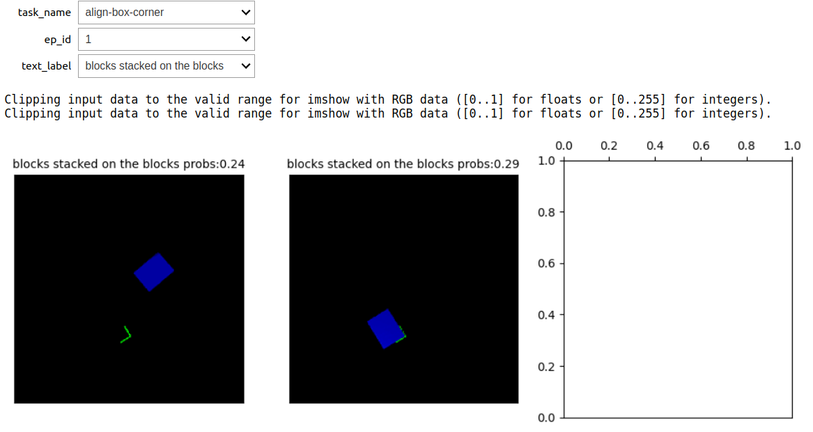

# Test result for CLIP

## Review

Initially, I believed that CLIP was a caption prediction model, but upon further examination, I discovered that it is actually a classification model. Given a set of caption or description, it is capable of choosing the most appropriate textual description for an encoded image by measuring the cosine similarities  between encoded image features and text features.

``

## CLIP prefix captioning

[ClipCap: CLIP Prefix for Image Captioning](https://arxiv.org/abs/2111.09734), [pre-trained model in COLAB](https://colab.research.google.com/drive/1tuoAC5F4sC7qid56Z0ap-stR3rwdk0ZV?usp=sharing)

there is a work for CLIP prefix Image Captioning, which will aotomatically give a text describtion for an image encoded by CLIP. For this test, the image is from the observation in CLIPort.I upload them in google Colab and predict the caption with pretrained models. However, the caption is nearly irrelevant to the image information.

Therefore it is not reasonable use those predicted caption to set reward.

## Reward Setting

I come up with 2 ways for reward setting.

1) measure cosine similarity between steps.
2) Measure the change in probability for each label.

## Experiment

### change in probability of label

I did some test about the "change in probability". The observation of 5 tasks in CLIPort is collected included:

1) "align box in the corner",
2) 'assembling-kits',
3) 'block-insertion',
4) 'stack-block-pyramid'
5) 'sweeping-piles'.

The label and its opposite describtion are encoded to measure the possibility of each label.
5 labels are:

1) "all blocks are (not) on the hole",
2) "blocks (not) stacked on the blocks",
3) "blocks are (not) aligned with the corner",
4) "piles are  (not)  swept into the square",
5) "block is (not) inserted into the L-shape hole",

The main purpose of this experiment is to observe the change of label possibility in different steps.
This figure is about a 'assembling-kits' task demonstration with label "all blocks are (not) on the hole". The possibility of "all blocks are on the hole" increase in this episode, which means the CLIP can understanding what the robot is doing (putting kits on the hole.) This is the result we want to have to setting reward.

However, there are 2 cases we do not want:

1) false positive: the possibility change a lot but robot do not actually to a corresponding action
2) false negative: the possibility do not change when robot do a corresponding action.

False negative case:
In this scenario, the label is "block is (not) inserted into the L-shape hole" and action is 'assembling-kits'. As the figure shows below, when the L shape block is put in L shape hole, the probability of the caption is reduced from 34% to 32%.This result shows that the CLIP can not always understand the environment.

False positive cases:
In this senario, the label is "blocks (not) stacked on the blocks" and action is "align box in the corner". Even though the robot did not stack any block on the block, the probability still increase from 24% to29%.

### Measure similarity

For the task of measure similarity,
The change between actions are not always salient for complex scene. For the task "align box in the corner", the similarity between adjacent steps are about 98% which is hard to tell whether there is a meaningful action happens.

For a relatively simple tasks, the change in similarity is more obvious. For the task of block insertion, the action failed to insert in the first step, and sucess the insertion at the second step, the change in similarity for the second steps shows that the CLIP understand that there might be some change happened in environment.

## discussion

To avoid aforementioned False positive/negative cases,there might be some improvement:

1) the simulation is kind of dark. Even for human it is not clear about what is happened in the scene. It should looks more "real".
2) More concentrate in objects of CLIP encoder should be square(otherwise it might loss some information),so I have to make 320 * 160 CLIPort observation to a 320 * 320 image with dark padding, which make the CLIP less concentrate on the objects

For the reward setting, I still need to think about it. Currently I would prefer a combination of "change in Probability of label"(a reward with direction) and the similarity between each steps (a reward without predefined direction.)
